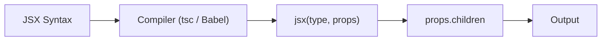

```mermaid
flowchart LR
	JSX["JSX Syntax"] --> Compiler["Compiler (tsc / Babel)"]
	Compiler --> Runtime["jsx(type, props)"]
	Runtime --> Children["props.children"]
	Children --> Nested["Output"]
```