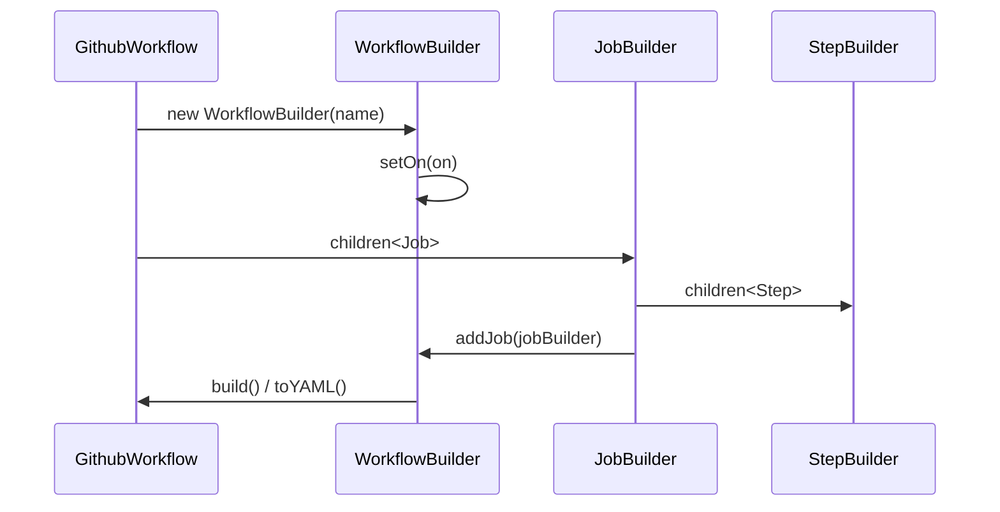

```mermaid
sequenceDiagram
	participant W as GithubWorkflow
	participant B as WorkflowBuilder
	participant J as JobBuilder
	participant S as StepBuilder
	W->>B: new WorkflowBuilder(name)
	B->>B: setOn(on)
	W->>J: children<Job>
	J->>S: children<Step>
	J->>B: addJob(jobBuilder)
	B->>W: build() / toYAML()
```