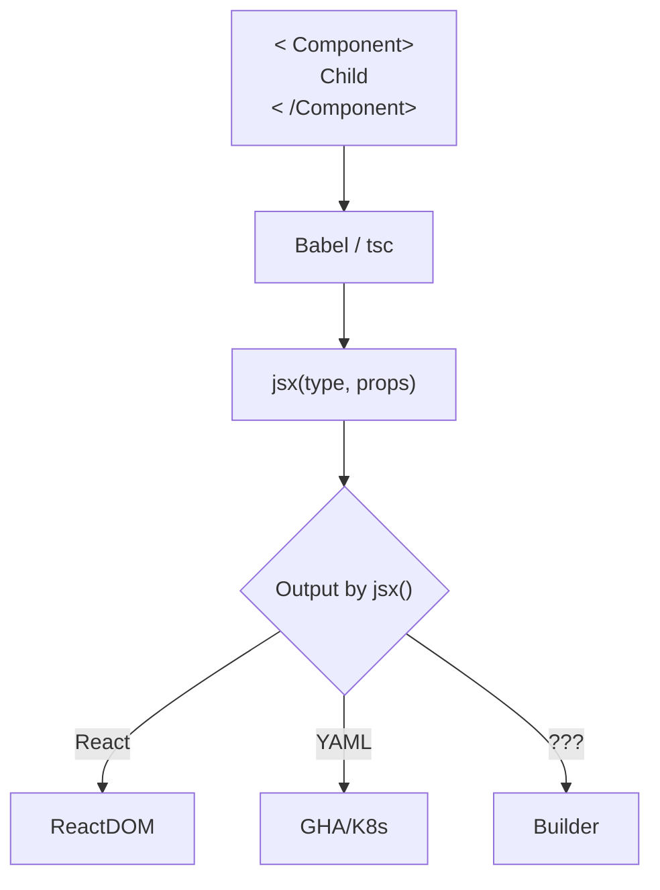

```mermaid
flowchart TB
	JSX["< Component> 
	Child 
	< /Component>"] --> Compiler["Babel / tsc"]
	--> Runtime["jsx(type, props)"]
	--> Output{"Output by jsx()"}
	Output -->|React| ReactDOM
	Output -->|YAML| GHA/K8s
	Output -->|???| Builder
```